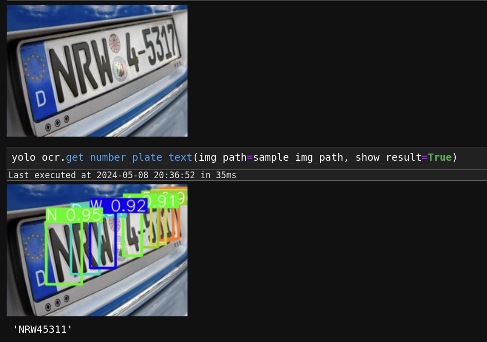

# yoloNpdOCR


<!-- WARNING: THIS FILE WAS AUTOGENERATED! DO NOT EDIT! -->

## Install

``` sh
pip install yoloNpdOCR
```

## How to use

- Checkout inference file
- Two lines of code:
- 1.) yolo_ocr = MyYoloOCR(weights_file_location=cnfg.weights_path)
- 2.) yolo_ocr.get_number_plate_text(img_path=sample_img_path,
  show_result=True)

``` python
pil_im
```


